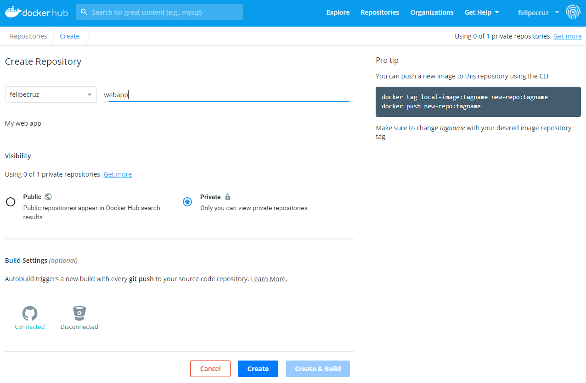
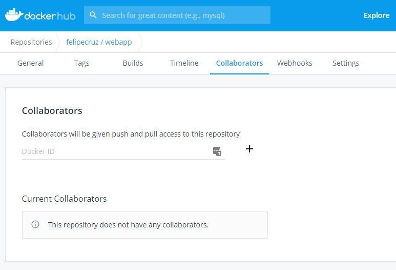

# push-to-dockerhub

## Create an account in Docker Hub

Sign up in [Docker Hub](https://hub.docker.com/signup) to create a Docker ID. You will need this in order to create a repository and push Docker images to it.

## Create a private repository

[Create a private repository](https://hub.docker.com/repository/create) in Docker Hub with name `webapp`:



## Log into a Docker registry

```
$ docker login 

Login with your Docker ID to push and pull images from Docker Hub. If you don't have a Docker ID, head over to https://hub.docker.com to create one.

Username: felipecruz
Password: ********

WARNING! Your password will be stored unencrypted in /home/felipe/.docker/config.json.
Configure a credential helper to remove this warning. See
https://docs.docker.com/engine/reference/commandline/login/#credentials-store

Login Succeeded
```

## Build your image

Go to the [webapp](./webapp) folder and build your project locally using the given Dockerfile. 

```
$ cd webapp
$ docker build -t webapp .
```

## Tag your image

```
$ docker tag webapp felipecruz/webapp
```

Push your image:

```
$ docker push felipecruz/webapp

The push refers to repository [docker.io/felipecruz/webapp]
60d67f8af71d: Pushed
290cec21aafb: Mounted from library/openjdk
e7f8b07649a4: Mounted from library/openjdk
109e67eff29c: Mounted from library/openjdk
556c5fb0d91b: Mounted from library/redis
latest: digest: sha256:70d75c2e9b2e004b296659742681da771e125153e5dada3ae1d5a721355c9bbe size: 1371
```

Anyone that is a collaborator in your repository can pull your image. Feel free to add some of your colleagues as collaborators through the Docker Hub web so that they can pull and run your image too!



Finally, you can pull the image and run it as a container with the following command:

```
$ docker run --name webapp --rm -d -p 3000:8080 felipecruz/webapp:latest
```

Visit http://localhost:3000/ and you should see the message:

`Handling request from <container-id> by Felipe`

## Clean up

```
$ docker stop webapp
```
